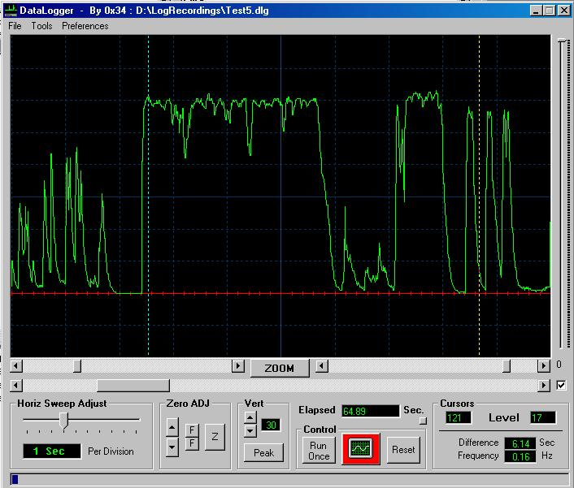

<div align="center">

## Data Logger


</div>

### Description

(Refer to DataLogger 2 for newest version) - I wrote this program to monitor the input of an RS232 Serial Port and graphically log all activity. It acts and operates just like a Digital Storage Oscilloscope, capable of logging up to 5 hours in one file. It also has real time cursors, displaying amplitude, time and frequency.

The program monitors a selected Comm Port and records the digital values sent to it (Range 0 ~ 255). It runs in two clock modes (Horiz step modes) selectable by the user. It does not send anything out the port. It reads the port only.

All files are saved as DataLogger Files (*.dlg). This is a fully functional program which will allow you to hunt bugs and/or test your embedded micro projects with ease.
 
### More Info
 


<span>             |<span>
---                |---
**Submitted On**   |2004-11-04 12:42:54
**By**             |[0x34](https://github.com/Planet-Source-Code/PSCIndex/blob/master/ByAuthor/0x34.md)
**Level**          |Advanced
**User Rating**    |4.6 (78 globes from 17 users)
**Compatibility**  |VB 6\.0
**Category**       |[Miscellaneous](https://github.com/Planet-Source-Code/PSCIndex/blob/master/ByCategory/miscellaneous__1-1.md)
**World**          |[Visual Basic](https://github.com/Planet-Source-Code/PSCIndex/blob/master/ByWorld/visual-basic.md)
**Archive File**   |[Data\_Logge1814411142004\.zip](https://github.com/Planet-Source-Code/0x34-data-logger__1-56776/archive/master.zip)

### API Declarations

```
Declare Function sndPlaySound Lib "winmm.dll" Alias "sndPlaySoundA" ( _
 ByVal lpszSoundName As String, ByVal uFlags As Long) As Long
```


